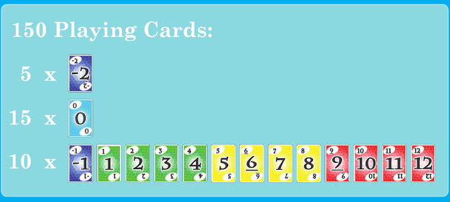
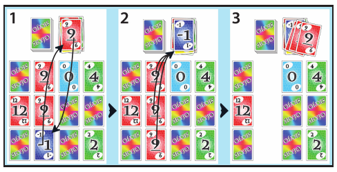
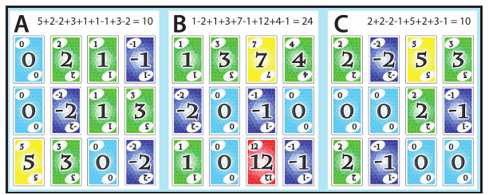

# SKYJO - Règles du jeu

> Règles du projet pour l'implémentation numérique de SKYJO. La notice officielle de Magilano constitue la source normative pour les mécaniques principales. La dernière partie documente les décisions supplémentaires nécessaires à notre projet pour les égalités, l'épuisement de la pioche, les délais, les déconnexions et les abandons.

## Synthèse rapide

- **Joueurs :** 2 à 4.
- **But :** terminer la partie avec le **plus petit score total**.
- Chaque joueur commence chaque manche avec **12 cartes face cachée disposées en 3 lignes x 4 colonnes** et révèle **2 cartes au choix**.
- À son tour, un joueur peut soit :
  1. prendre la carte visible au sommet de la défausse et **l'échanger** contre l'une de ses cartes ;
  2. piocher la première carte face cachée de la pioche, puis soit **l'échanger** contre l'une de ses cartes, soit **la défausser et révéler l'une de ses cartes face cachée**.
- Trois cartes identiques visibles dans une **même colonne verticale** sont immédiatement retirées et placées sur la défausse.
- Une manche entre dans sa phase de fin lorsqu'un joueur n'a plus aucune carte face cachée. Tous les autres joueurs disposent alors d'**un dernier tour**.
- Après les dernières suppressions de colonnes, chaque joueur additionne les valeurs de toutes les cartes restant dans son tableau.
- Le joueur qui a déclenché la fin de la manche doit avoir un score de manche **strictement inférieur** à celui de tous les autres joueurs. Si un autre joueur possède un score inférieur ou égal, le score **positif** du finisseur est doublé. Un score nul ou négatif n'est jamais doublé.
- Les scores de manche s'ajoutent aux scores cumulés. Après une manche où au moins un joueur atteint **100 points ou plus**, la partie se termine ; le plus petit score cumulé gagne.

---

## 1. Matériel et composition du paquet

Le jeu officiel contient **150 cartes**.

| Valeur | Nombre de cartes |
| ---: | ---: |
| `-2` | 5 |
| `0` | 15 |
| `-1` | 10 |
| `1` à `12` | 10 exemplaires de chaque valeur |



*Répartition des cartes.*

La valeur imprimée sur une carte correspond directement au nombre de points qu'elle rapporte. Les petites valeurs sont donc généralement préférables.

## 2. But de la partie

SKYJO se joue en plusieurs manches. Les joueurs accumulent des points d'une manche à l'autre.

L'objectif est de conserver un score cumulé aussi faible que possible. La condition normale de fin de partie est atteinte lorsque, après le décompte d'une manche, au moins un joueur possède un score cumulé de **100 points ou plus**. Le ou les joueurs ayant alors le plus petit score cumulé remportent la partie.

## 3. Terminologie

- **Tableau :** ensemble des cartes appartenant à un joueur pendant une manche.
- **Carte face cachée :** carte du tableau dont la valeur n'est pas encore connue.
- **Carte face visible :** carte révélée dont la valeur est visible de tous.
- **Pioche :** pile face cachée depuis laquelle les cartes inconnues sont tirées.
- **Défausse :** pile face visible ; en temps normal, seule sa carte supérieure peut être prise.
- **Finisseur :** joueur dont le tableau ne contient plus aucune carte face cachée et qui déclenche ainsi la phase des derniers tours.
- **Score de manche :** points obtenus pour une manche après suppression des colonnes et éventuelle pénalité du finisseur.
- **Score cumulé :** somme des scores de manche d'un joueur sur l'ensemble de la partie.

## 4. Préparation d'une manche

1. Mélanger l'ensemble du paquet.
2. Distribuer **12 cartes face cachée** à chaque joueur.
3. Chaque joueur dispose ses 12 cartes dans un tableau fixe de **3 x 4** :

   ```text
   [ ? ] [ ? ] [ ? ] [ ? ]
   [ ? ] [ ? ] [ ? ] [ ? ]
   [ ? ] [ ? ] [ ? ] [ ? ]
     C1    C2    C3    C4
   ```

   Chaque colonne verticale contient donc exactement trois emplacements.
4. Placer une carte supplémentaire face visible au centre : elle constitue la première carte de la **défausse**.
5. Placer toutes les cartes restantes face cachée à côté pour former la **pioche**.
6. Chaque joueur choisit **deux cartes de son propre tableau** et les révèle.

Les joueurs ne doivent regarder aucune autre carte face cachée de leur tableau pendant ce choix initial.

## 5. Détermination du premier joueur

### Première manche

Additionner les valeurs des deux cartes initialement révélées par chaque joueur. Celui dont la **somme est la plus élevée** commence la première manche.

Exemple : un joueur révélant `12` et `-2` obtient une somme de `10`; un joueur révélant `4` et `2` obtient `6`. Le premier commence car `10 > 6`.

Pour notre projet, une égalité sur la plus grande somme initiale est résolue par la procédure serveur de départage **pierre-feuille-ciseaux** définie pour la partie.

### Manches suivantes

Le joueur qui a **terminé la manche précédente** commence la manche suivante.

## 6. Ordre des tours

Le jeu progresse dans le **sens des aiguilles d'une montre**.

Un tour normal commence toujours par le choix d'une seule des deux sources suivantes :

- la carte face visible située au sommet de la défausse ;
- la carte face cachée située au sommet de la pioche.

Les conséquences dépendent de la source choisie.

## 7. Prendre la carte supérieure de la défausse

Lorsqu'un joueur prend la carte visible au sommet de la défausse :

1. Cette carte **doit être conservée**. Elle ne peut pas être immédiatement rejetée.
2. Le joueur choisit exactement une carte de son tableau à remplacer.
3. Cette carte peut être face visible ou face cachée.
4. Si elle est face cachée, le joueur ne peut **pas la regarder avant de s'être engagé dans l'échange**.
5. La carte prise dans la défausse est placée face visible à cet emplacement.
6. La carte remplacée est placée face visible au sommet de la défausse.
7. La règle des colonnes identiques est appliquée si l'échange a créé une colonne complète de trois cartes identiques visibles.
8. Le tour se termine.

## 8. Piocher une carte face cachée

Lorsqu'un joueur prend la première carte face cachée de la pioche, il peut consulter sa valeur puis choisir entre deux actions.

### 8.1 Conserver la carte piochée

Le joueur l'échange contre une carte de son tableau :

1. Choisir une carte face visible ou face cachée du tableau.
2. Une cible face cachée ne peut pas être consultée avant le choix.
3. Placer la carte piochée face visible à cet emplacement.
4. Placer la carte remplacée face visible sur la défausse.
5. Appliquer la règle des colonnes identiques si nécessaire.
6. Le tour se termine.

### 8.2 Refuser la carte piochée

Le joueur peut décider de ne pas conserver la carte piochée :

1. Placer la carte piochée face visible au sommet de la défausse.
2. Choisir **une carte encore face cachée** dans son propre tableau.
3. Révéler cette carte sur place ; elle n'est ni échangée ni déplacée.
4. Appliquer la règle des colonnes identiques si cette révélation complète une colonne de trois cartes identiques.
5. Le tour se termine.

Il est impossible de refuser la carte piochée sans révéler l'une de ses propres cartes encore cachées.

## 9. Trois cartes identiques dans une colonne verticale

Dès que les trois emplacements d'une colonne verticale contiennent **trois cartes face visible de même valeur**, l'intégralité de la colonne est retirée du tableau et placée sur la défausse.



*Illustration officielle Magilano, page 5 : un échange complète une colonne de trois cartes identiques, qui est ensuite retirée.*

Conséquences importantes :

- Les trois cartes retirées ne font plus partie du tableau du joueur et rapportent donc **0 point** pour cette manche.
- Les trois emplacements restent vides ; ils ne sont pas remplis à nouveau.
- La règle s'applique que la troisième carte identique soit apparue après un échange ou après la révélation d'une carte cachée.
- Si la colonne est créée par un échange, la **carte remplacée est d'abord placée sur la défausse**, puis les trois cartes identiques sont déposées par-dessus. Une des cartes identiques devient donc la carte supérieure de la défausse.
- La règle s'applique également lors de la résolution de fin de manche, lorsque les cartes encore cachées sont révélées pour le décompte.
- Si plusieurs colonnes identiques complètes existent après la révélation finale, **toutes les colonnes valides sont retirées avant le calcul du score**.

## 10. Déclenchement de la fin d'une manche

Un joueur devient le **finisseur** dès qu'après résolution de son action et de toutes les suppressions de colonnes qui en résultent, son tableau ne contient **plus aucune carte face cachée**.

La manche ne s'arrête pas immédiatement. Cela déclenche la **phase des derniers tours**.

Tous les autres joueurs encore actifs disposent exactement d'**un tour supplémentaire**, dans le sens des aiguilles d'une montre, jusqu'au moment où le tour devrait revenir au finisseur. Le finisseur ne rejoue pas pendant cette phase.

## 11. Révélation finale et résolution des colonnes

Une fois que tous les autres joueurs ont effectué leur dernier tour :

1. Révéler toutes les cartes des tableaux encore face cachée.
2. Rechercher de nouveau les colonnes verticales constituées de trois valeurs identiques.
3. Retirer toutes ces colonnes avant le décompte.
4. Additionner les valeurs de toutes les cartes restant dans le tableau de chaque joueur.

Les cartes retirées ne sont pas comptabilisées.

## 12. Décompte de la manche et pénalité du finisseur

Le score normal d'une manche est la somme des valeurs de toutes les cartes encore présentes dans le tableau d'un joueur après suppression des colonnes.

Le finisseur est soumis à une règle supplémentaire : son score doit être **strictement inférieur au score de chacun des autres joueurs pour cette manche**.

Si au moins un autre joueur possède un score **inférieur ou égal** à celui du finisseur :

- si le score du finisseur est **positif**, il est doublé ;
- si le score du finisseur vaut `0` ou est négatif, il n'est **pas** doublé.

Aucun autre joueur n'est concerné par cette pénalité.



*Exemple officiel Magilano, page 5 : A termine avec 10 points, B en possède 24 et C possède également 10 points. Comme A est à égalité au lieu d'être strictement inférieur, son score positif est doublé à 20.*

### Exemples

| Finisseur | Meilleur autre score | Pénalité ? | Score enregistré du finisseur |
| ---: | ---: | :---: | ---: |
| `10` | `12` | Non | `10` |
| `10` | `10` | Oui | `20` |
| `10` | `5` | Oui | `20` |
| `0` | `-1` | Pas de doublement | `0` |
| `-2` | `-5` | Pas de doublement | `-2` |

Le score de manche ainsi obtenu est ensuite ajouté au score cumulé de chaque joueur.

## 13. Fin de la partie

Une fois tous les scores de la manche finalisés et ajoutés aux scores cumulés, vérifier le seuil de fin de partie.

Si **aucun joueur n'a atteint 100 points**, une nouvelle manche est préparée.

Si **au moins un joueur a atteint 100 points ou plus**, la partie se termine. Le vainqueur est le joueur actif ayant le **plus petit score cumulé**.

Pour notre projet, si plusieurs joueurs sont à égalité pour le plus petit score cumulé final, ils sont **co-vainqueurs**. Aucun départage supplémentaire n'est appliqué au résultat final.

## 14. Règles numériques spécifiques au projet

### 14.1 Pioche vide

Si la pioche est vide alors qu'une carte doit être piochée :

1. Conserver en place la **carte supérieure actuelle de la défausse**.
2. Récupérer toutes les autres cartes de la défausse.
3. Mélanger ces cartes.
4. Les utiliser comme nouvelle pioche face cachée.

La carte visible située au sommet de la défausse n'est jamais incluse dans ce remélange.

### 14.2 Expiration du délai de révélation initiale

Si un joueur n'a pas choisi ses deux cartes initiales avant l'expiration du délai prévu, le serveur sélectionne aléatoirement et révèle **deux cartes face cachée valides** de son tableau.

### 14.3 Déconnexion définitive et abandon

Un joueur qui abandonne la partie reçoit une **défaite**.

## 15. Invariants utiles pour l'implémentation

Les propriétés suivantes doivent rester vraies dans le moteur de jeu :

- Le tableau d'un joueur commence avec 12 positions occupées organisées en quatre colonnes verticales de trois cartes.
- Les cartes d'un tableau ne changent pas d'emplacement sauf lorsqu'une position est remplacée ; une suppression de colonne vide exactement trois positions.
- Toute position occupée du tableau contient une carte soit face cachée, soit face visible.
- Une carte prise dans la défausse est toujours échangée ; elle ne peut pas être refusée.
- Une carte prise dans la pioche est soit échangée dans le tableau, soit défaussée puis suivie de la révélation d'exactement une carte.
- Une carte face cachée du tableau n'est jamais consultée avant que le joueur se soit engagé à la remplacer.
- Toute carte défaussée ou retirée d'un tableau est placée face visible sur la défausse.
- Une colonne identique complète est résolue avant que le tour actif ou le décompte ne soit considéré comme terminé.
- Une fois la phase des derniers tours commencée, chaque autre joueur reçoit au maximum un dernier tour.
- Toutes les cartes encore cachées sont révélées avant le décompte de la manche.
- Toutes les colonnes identiques complètes découvertes lors de cette révélation finale sont retirées avant le calcul des scores.
- Seul le finisseur peut recevoir la pénalité de doublement du score de manche.
- Cette pénalité ne double jamais un score nul.
- Les scores cumulés ne changent qu'au moment du décompte d'une manche.
- La condition normale de fin de partie à 100 points est évaluée uniquement après l'ajout des scores de manche.
