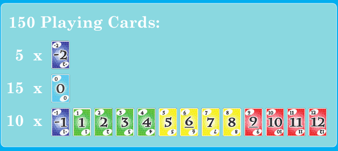
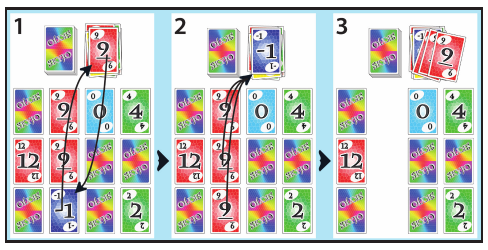
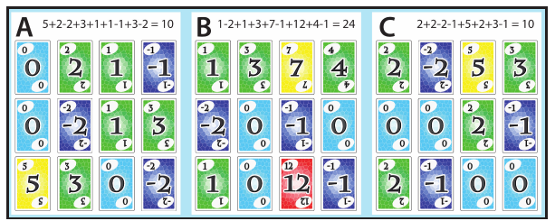

# SKYJO - Règles du jeu

> Règles utilisées par cette version numérique de SKYJO.

## Synthèse rapide

- **Joueurs :** 2 à 4.
- **But :** terminer la partie avec le **plus petit score cumulé**.
- Au début de chaque manche, chaque joueur reçoit **12 cartes face cachée disposées en 3 lignes x 4 colonnes** et révèle **2 cartes au choix**.
- À son tour, un joueur peut soit :
  1. prendre la carte visible au sommet de la défausse et **l'échanger** contre l'une de ses cartes ;
  2. piocher la première carte face cachée de la pioche, puis soit **l'échanger** contre l'une de ses cartes, soit **la défausser et révéler l'une de ses cartes face cachée**.
- Trois cartes identiques visibles dans une **même colonne verticale** sont immédiatement retirées et placées sur la défausse.
- Une manche entre dans sa phase de fin lorsqu'un joueur n'a plus aucune carte face cachée. Tous les autres joueurs disposent alors d'**un dernier tour**.
- À la fin de la manche, les éventuelles dernières colonnes identiques sont retirées puis les scores sont calculés.
- Le joueur qui a déclenché la fin de la manche doit avoir un score de manche **strictement inférieur** à celui de tous les autres joueurs. Si un autre joueur possède un score inférieur ou égal, le score **positif** du finisseur est doublé. Un score nul ou négatif n'est jamais doublé.
- Les scores de manche sont ajoutés aux scores cumulés. Après une manche où au moins un joueur atteint **100 points ou plus**, la partie se termine ; le plus petit score cumulé gagne.

---

## 1. Composition du paquet

Le jeu contient **150 cartes**.

| Valeur | Nombre de cartes |
| ---: | ---: |
| `-2` | 5 |
| `-1` | 10 |
| `0` | 15 |
| `1` à `12` | 10 exemplaires de chaque valeur |



*Répartition des cartes.*

La valeur inscrite sur une carte correspond directement au nombre de points qu'elle rapporte. Les petites valeurs sont donc généralement préférables.

## 2. But de la partie

SKYJO se joue en plusieurs manches. Les joueurs accumulent des points d'une manche à l'autre.

L'objectif est de conserver un score cumulé aussi faible que possible. Après le décompte d'une manche, si au moins un joueur possède un score cumulé de **100 points ou plus**, la partie se termine. Le ou les joueurs ayant alors le plus petit score cumulé remportent la partie.

## 3. Terminologie

- **Tableau :** ensemble des cartes appartenant à un joueur pendant une manche.
- **Carte face cachée :** carte du tableau dont la valeur n'est pas visible.
- **Carte face visible :** carte révélée dont la valeur est visible de tous.
- **Pioche :** pile face cachée depuis laquelle les cartes sont piochées.
- **Défausse :** pile face visible ; seule sa carte supérieure peut être prise au début d'un tour.
- **Finisseur :** joueur dont le tableau ne contient plus aucune carte face cachée et qui déclenche ainsi la phase des derniers tours.
- **Score de manche :** points obtenus pour une manche après suppression des colonnes et éventuelle pénalité du finisseur.
- **Score cumulé :** somme des scores de manche d'un joueur depuis le début de la partie.

## 4. Début d'une manche

Au début de chaque manche, le paquet complet est mélangé.

Chaque joueur reçoit **12 cartes face cachée**, disposées dans un tableau fixe de **3 lignes x 4 colonnes** :

```text
[ ? ] [ ? ] [ ? ] [ ? ]
[ ? ] [ ? ] [ ? ] [ ? ]
[ ? ] [ ? ] [ ? ] [ ? ]
  C1    C2    C3    C4
```

Chaque colonne verticale contient donc exactement trois emplacements.

Une carte supplémentaire est placée face visible pour constituer le début de la **défausse**. Toutes les autres cartes forment la **pioche**, face cachée.

Chaque joueur choisit ensuite **deux cartes de son propre tableau** et les révèle. Aucune autre carte face cachée de son tableau ne peut être consultée pendant ce choix initial.

## 5. Détermination du premier joueur

### Première manche

Une fois que tous les joueurs ont révélé leurs deux cartes initiales, la somme de ces deux cartes est calculée pour chacun d'eux. Le joueur dont la **somme est la plus élevée** commence la première manche.

Exemple : un joueur révélant `12` et `-2` obtient une somme de `10`, tandis qu'un joueur révélant `4` et `2` obtient `6`. Le premier commence donc la manche.

Si plusieurs joueurs sont à égalité pour la plus grande somme initiale, **un seul d'entre eux est choisi aléatoirement** pour commencer la première manche.

### Manches suivantes

Le **finisseur de la manche précédente** commence la manche suivante.

## 6. Déroulement d'un tour

Les joueurs jouent à tour de rôle selon un ordre fixe et circulaire établi pour la partie.

Au début de son tour, le joueur actif choisit l'une des deux possibilités suivantes :

- prendre la carte face visible située au sommet de la défausse ;
- piocher la carte située au sommet de la pioche.

Les possibilités qui suivent dépendent de la source choisie.

## 7. Prendre la carte supérieure de la défausse

Lorsqu'un joueur prend la carte visible au sommet de la défausse, cette carte **doit être conservée** : elle ne peut pas être immédiatement rejetée.

Le joueur choisit une carte de son propre tableau à remplacer. Cette carte peut être face visible ou face cachée. Si elle est face cachée, sa valeur ne peut pas être consultée avant que le joueur ait choisi cet emplacement.

L'échange est alors effectué :

- la carte prise dans la défausse est placée face visible à l'emplacement choisi ;
- la carte remplacée est placée face visible au sommet de la défausse ;
- si l'échange complète une colonne verticale de trois cartes identiques visibles, cette colonne est immédiatement retirée selon la règle décrite en section 9.

Le tour se termine ensuite.

## 8. Piocher une carte dans la pioche

Lorsqu'un joueur pioche la carte située au sommet de la pioche, sa valeur devient immédiatement **visible par tous les joueurs**. Le joueur choisit ensuite de la conserver ou de la refuser.

### 8.1 Conserver la carte piochée

Le joueur choisit une carte de son tableau à remplacer. Cette carte peut être face visible ou face cachée. Une carte face cachée ne peut pas être consultée avant que son emplacement ait été choisi.

L'échange est alors effectué :

- la carte piochée est placée face visible à l'emplacement choisi ;
- la carte remplacée est placée face visible au sommet de la défausse ;
- si l'échange complète une colonne verticale de trois cartes identiques visibles, cette colonne est immédiatement retirée.

Le tour se termine ensuite.

### 8.2 Refuser la carte piochée

Si le joueur ne souhaite pas conserver la carte piochée, celle-ci est placée face visible au sommet de la défausse.

Le joueur doit alors choisir **une carte encore face cachée** de son propre tableau et la révéler. Cette carte reste à son emplacement.

Si cette révélation complète une colonne verticale de trois cartes identiques visibles, cette colonne est immédiatement retirée.

Le tour se termine ensuite.

Il est impossible de refuser la carte piochée sans révéler l'une de ses propres cartes encore face cachée.

## 9. Trois cartes identiques dans une colonne verticale

Dès que les trois emplacements d'une colonne contiennent **trois cartes face visible de même valeur**, la colonne entière est retirée du tableau et les trois cartes sont placées sur la défausse.



*Un échange complète une colonne de trois cartes identiques, qui est ensuite retirée.*

Conséquences :

- les trois cartes retirées ne font plus partie du tableau du joueur et rapportent donc **0 point** pour cette manche ;
- les trois emplacements restent vides et ne sont pas remplis à nouveau ;
- la règle s'applique que la troisième carte identique soit apparue après un échange ou après la révélation d'une carte cachée ;
- si la colonne est créée par un échange, la **carte remplacée est d'abord placée sur la défausse**, puis les trois cartes identiques sont déposées par-dessus ; une des cartes identiques devient donc la nouvelle carte supérieure de la défausse ;
- la même règle s'applique lors de la résolution de fin de manche, lorsque les éventuelles cartes encore cachées sont révélées.

## 10. Déclenchement de la fin d'une manche

Un joueur devient le **finisseur** lorsque, après résolution complète de son action et des éventuelles suppressions de colonnes, son tableau ne contient **plus aucune carte face cachée**.

La manche ne s'arrête pas immédiatement. Tous les autres joueurs encore actifs disposent exactement d'**un dernier tour**, en suivant l'ordre habituel des joueurs. Le finisseur ne joue pas de nouveau pendant cette phase.

Lorsque chacun des autres joueurs a effectué ce dernier tour, la manche est terminée.

## 11. Résolution de fin de manche

À la fin des derniers tours :

1. toutes les cartes des tableaux encore face cachée sont révélées automatiquement ;
2. toutes les colonnes verticales composées de trois cartes identiques visibles sont retirées ;
3. le score de manche de chaque joueur est calculé à partir des cartes qui restent dans son tableau.

Les cartes retirées ne sont pas comptabilisées dans le score.

## 12. Décompte de la manche et pénalité du finisseur

Le score de manche d'un joueur correspond à la somme des valeurs de toutes les cartes encore présentes dans son tableau après les dernières suppressions de colonnes.

Le **finisseur** est soumis à une règle supplémentaire : son score doit être **strictement inférieur** au score de chacun des autres joueurs pour cette manche.

Si au moins un autre joueur possède un score **inférieur ou égal** à celui du finisseur :

- si le score du finisseur est **positif**, il est doublé ;
- si le score du finisseur vaut `0` ou est négatif, il n'est **pas** doublé.

Aucun autre joueur n'est concerné par cette pénalité.



*Exemple : A termine avec 10 points, B en possède 24 et C possède également 10 points. Comme A est à égalité au lieu d'être strictement inférieur, son score positif est doublé à 20.*

### Exemples

| Finisseur | Meilleur second score |    Pénalité ?     | Score enregistré du finisseur |
| --------: | --------------------: | :---------------: | ----------------------------: |
|      `10` |                  `12` |        Non        |                          `10` |
|      `10` |                  `10` |        Oui        |                          `20` |
|      `10` |                   `5` |        Oui        |                          `20` |
|      `-2` |                  `-5` | Pas de doublement |                          `-2` |

Une fois le décompte terminé, le score de manche obtenu par chaque joueur est ajouté automatiquement à son score cumulé.

## 13. Fin de la partie et manche suivante

Après l'ajout des scores de manche aux scores cumulés :

- si **aucun joueur n'a atteint 100 points**, une nouvelle manche peut commencer ;
- si **au moins un joueur a atteint 100 points ou plus**, la partie se termine.

À la fin de la partie, le ou les joueurs ayant le **plus petit score cumulé** remportent la partie. Si plusieurs joueurs sont à égalité pour ce plus petit score, ils sont **co-vainqueurs** : aucun départage supplémentaire n'est effectué.

## 14. Règles supplémentaires de cette version numérique

### 14.1 Pioche vide

Si la pioche est vide au moment où une carte doit y être piochée, elle est automatiquement reconstituée :

1. la carte visible située au sommet de la défausse reste en place ;
2. toutes les autres cartes de la défausse sont récupérées et mélangées ;
3. ces cartes deviennent la nouvelle pioche face cachée.

La carte supérieure de la défausse n'est jamais incluse dans ce remélange.

### 14.2 Délai de jeu

Chaque joueur dispose d'un délai limité pour effectuer une action valide pendant son tour.

Si le joueur dont c'est le tour n'effectue aucune action valide avant l'expiration de ce délai, **la partie est arrêtée**.
